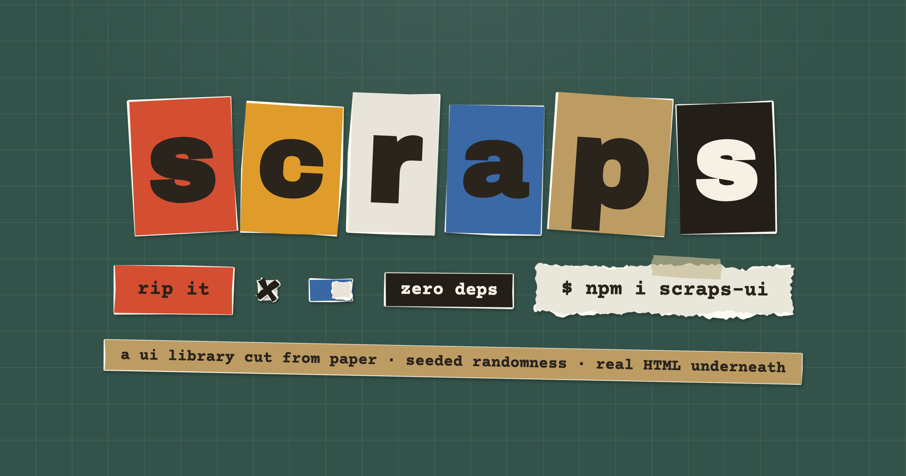

# scraps



**Demo: [scraps.ogme01.com](https://scraps.ogme01.com)**

A UI library where everything is cut and torn paper.

Every component is a real HTML element backed by a procedurally generated SVG
scrap. Torn edges get a fibrous white fringe, scissor-cut edges get straight
strokes with a little drift, and everything sits at a slightly crooked angle
with a paper-grain texture and a drop shadow. Randomness is seeded
(mulberry32): the same seed produces pixel-identical tears on any machine.
Hover a scrap and it re-tears itself, quivering like a 90s cartoon.

Real HTML inputs underneath. Zero dependencies. Two files.

## Install

```html
<link rel="stylesheet" href="scraps.css">
<script src="scraps.js"></script>
```

## Use

```html
<button data-scrap="button" data-color="coral">rip it</button>
<label data-scrap="toggle"><input type="checkbox"> deckle edges</label>
<div data-scrap="card" data-color="kraft" data-tape>a note, taped to the mat</div>

<script>
  Scraps.init()               // tear everything with [data-scrap]
  Scraps.reseed('zine-04')    // re-tear the whole page from a new seed
  Scraps.tear(el)             // re-tear one element
  Scraps.setProgress(el, 64)  // move a progress bar
  Scraps.boil = false         // disable hover re-tearing globally
</script>
```

## Components (`data-scrap`)

| type | element | edges |
| --- | --- | --- |
| `button` | `<button>` | cut |
| `chip` | any inline element | cut |
| `card` | any block element | torn |
| `field` | `<input>`, `<textarea>`, `<select>`, `<input type=range>` | cut |
| `checkbox` / `radio` / `toggle` | `<label>` wrapping an `<input>` | cut / torn |
| `progress` | `<div data-value="40" data-fill="coral">` | torn |
| `divider` | `<div>` | torn |

Selects open a paper dropdown instead of the native popup; the real
`<select>` keeps the value, the change events, and the keyboard focus.
Checkbox X marks land at a slightly different angle and position on every
check.

## Attributes

- `data-color`: `white · kraft · coral · marigold · blue · ink`
- `data-edge`: `torn | cut`, overrides the type's default
- `data-seed`: pin one element's tear so reseeds don't change it
- `data-rot`: max crookedness in degrees
- `data-amp`: tear amplitude in px
- `data-tape`: (cards) adds a strip of translucent tape
- `data-boil`: `"false"` keeps a scrap still under the cursor
- `data-fx`: `rip · fold · glue · shred`, a paper effect played on click; also
  callable directly as `Scraps.fx.rip(el)` etc. Skipped under reduced motion.

## Theming

Override the CSS custom properties on `:root`: `--sc-white`, `--sc-kraft`,
`--sc-coral`, `--sc-marigold`, `--sc-blue`, `--sc-ink`, `--sc-fringe`,
`--sc-shadow`, `--sc-text`, `--sc-text-light`.

## License

MIT
